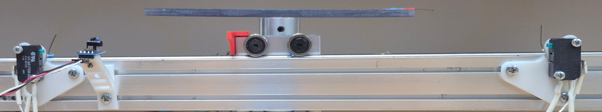

Hardware
==========

There are numerous pieces of hardware that interconnect to create the PET scan apparatus.  At a minimum, a pair of scintillation detectors sensitive to 511 keV gammas are needed.  We include schematics for a +1kV power supply that is capable of powering some common NaI(TI) scintillators coupled to Photomultiplier Tubes (PMTs).   A pair of 3d printed stands are provided that will work with 59mm diameter PMTs, but any reasonably stable implementation should be fine.  Several more 3d printed parts are provided which serve to lift the linear stage up slightly, provide support, and hold an optical sensor used for reset detection.

A screw-driven linear stage is used to move a sample between the paired detectors, with an additional rotation stage on top to allow for collecting of coincidence rate versus linear position and angle data. 

This setup uses a pair of stepper motors for positioning samples, each of which is managed by a DM542T stepper control unit.  Both stepper controllers are powered by a dedicated DC power supply, though they could be powered instead by a benchtop supply with sufficient current capacity.  

Three sensors are used here, two that help reset the sample to a known position and one which acts as an endstop to shut down the motor if the linear stage is driven too far.  A pair of microswitches are attached to the aluminum extrusion that houses the linear stage approximately [distance] apart, and the starting lateral position is also coincident with an optical detector used in the rotational zeroing algorithm.  Note that the optical sensor can be replaced with any device that runs on +- 3.3V and that outputs a 3.3V logic level (e.g. a hall effect sensor).

