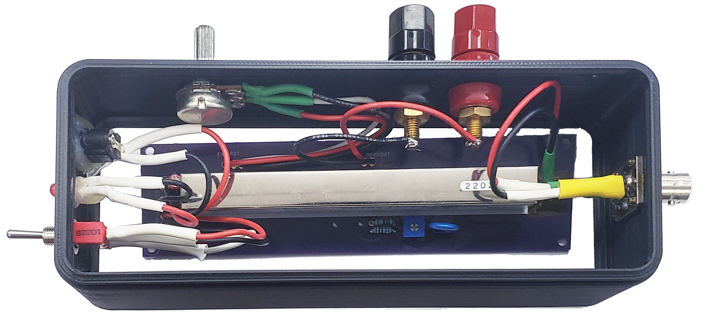

.. _Circuitry Page:

Circuitry
===============

There is only a small bit of external circuitry required to make this setup work, and a schematic can be seen below:

In order to facilitate ease of construction, the gerber files are available `here <https://github.com/UChicagoPhysicsLabs/PositronEmissionTomography/blob/main/Schematics/PET%20Hat%20Schematic.zip>`_ or you can order copies directly from OSHPark `here <https://oshpark.com/shared_projects/dNmJOCz3>`_.

This add-on board has a few purposes:
  * Power and receive signals from sensors
  * Send signals to motor controllers

    * Convert 3.3V logic levels to 5V outputs for motor controllers

A finished build is shown below:

Note that four of the five JST headers have pins removed.  This was intentional, as by removing those pins and filling the corresponding sockets with a solid material (hot glue is good) it is possible to make cables that cannot be connected improperly without heroic effort.  This makes the setup far more robust against assembly failures.

A board for a stand-alone `HV power supply is available here <https://oshpark.com/shared_projects/zzCgJzxe>`_

The finished board is shown below:

Note that most of the wiring here is 22AWG stranded core.  The flexibility is useful as it makes strain-related failures less likely when the module is fitted into its enclosure.

